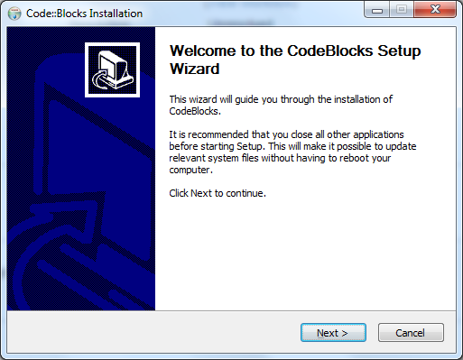

Установка и настройка Code::Blocks
==================================

**Code::Blocks** - среда разработки для C/C++.

* http://www.codeblocks.org/downloads/binaries - Среда разработки Code::Blocks (C/C++) вместе с библиотеками OpenGL

Варианты
--------
* **codeblocks-13.12-setup.exe** - только среда разработки без компилятора и отладчика. 
* **codeblocks-13.12mingw-setup.exe** - IDE + MinGW (компилятор + отладчик).
* **codeblocks-13.12mingw-setup-TDM-GCC-481.exe** - IDE + Альтернативный компилятор и отладчик.

Шаги по установке
-----------------
* Скачиваем **codeblocks-13.12mingw-setup.exe** 
* Устанавливаем _скриншоты_
* Настройки компилятора MinGW
* Создание консольного проекта (пример со скриншотами)
* Шаблон проекта

Установка Code::Blocks
----------------------
Запускаем скачанный **codeblocks-13.12mingw-setup.exe**



Соглашаемся с лицензией:


``` cpp

```


